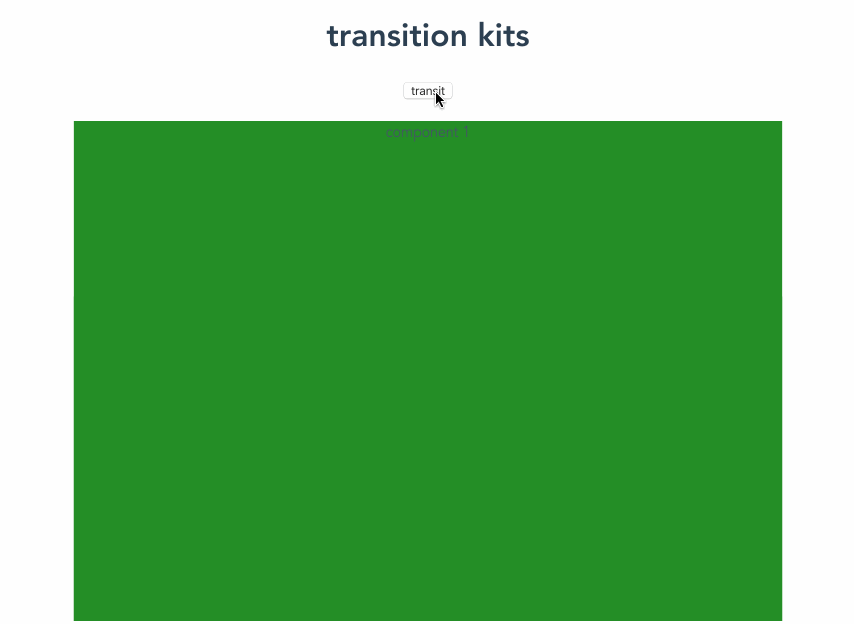
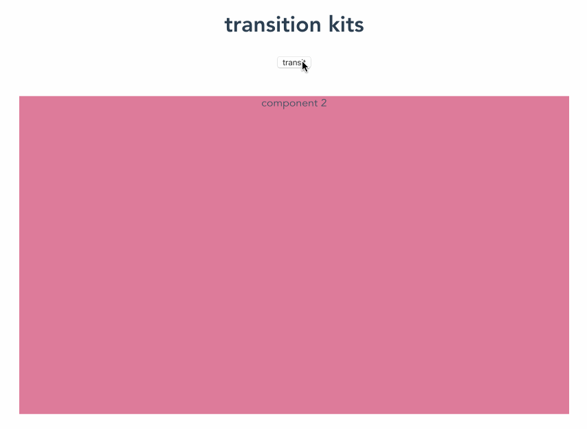
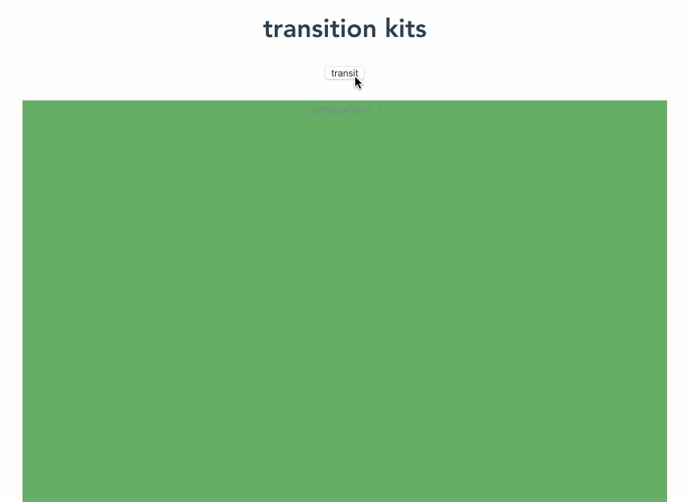
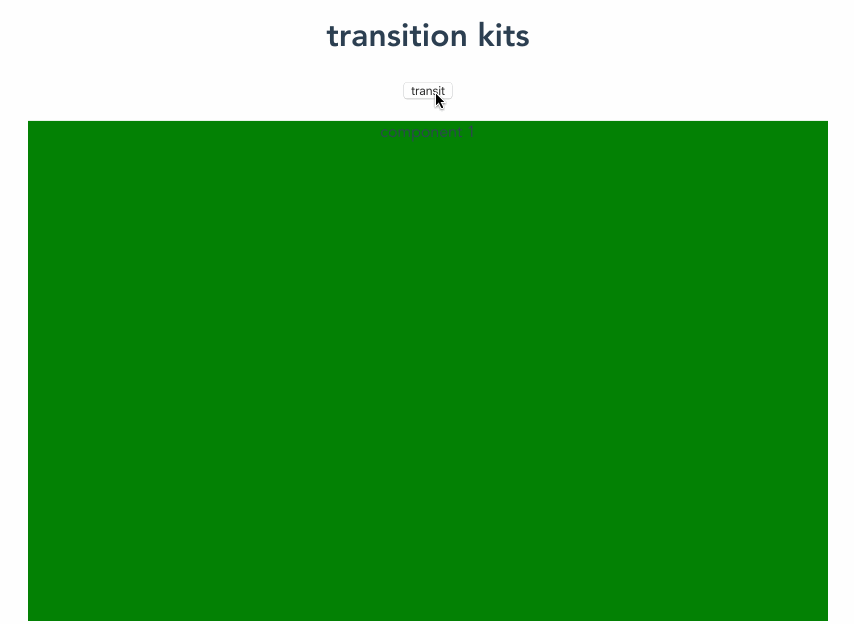
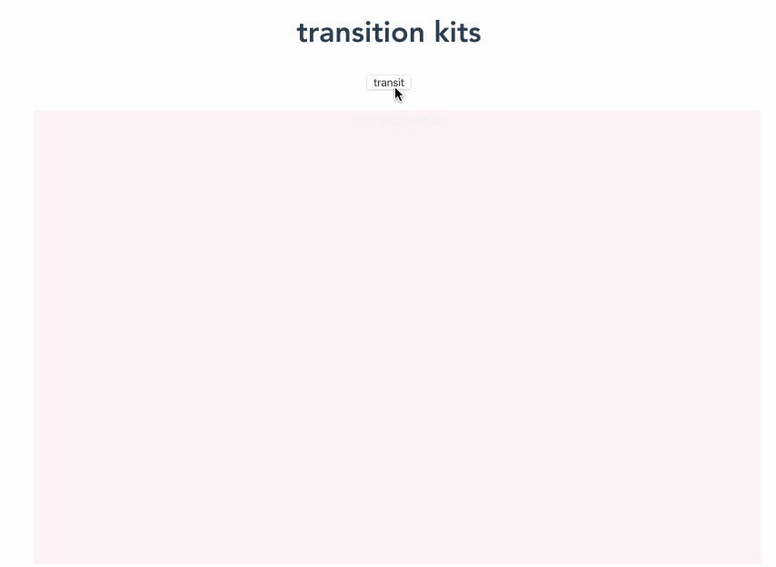
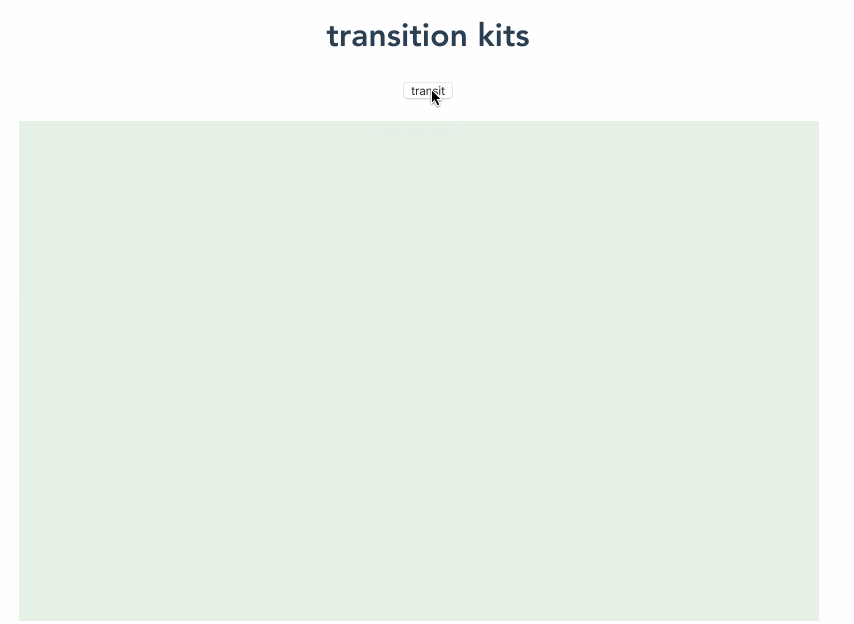
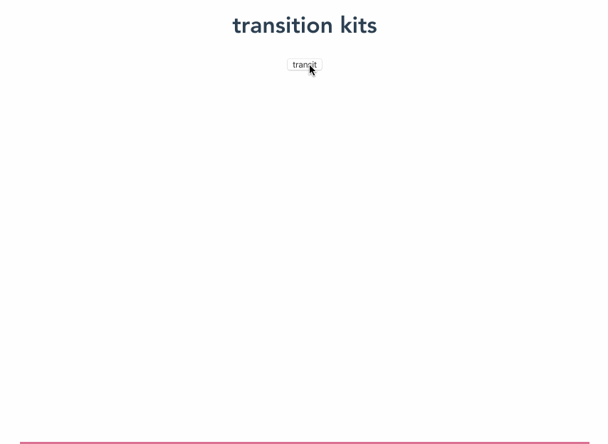
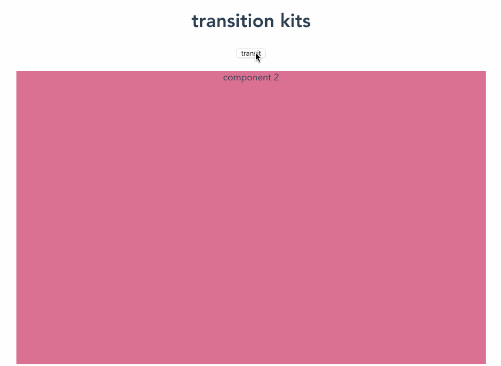

# transitions

the animation kits for vue components transition

> [vue 2.x supports](https://github.com/litt1e-p/transitions)

#### Installation

```js
npm i @litt1e-p/transitions@next
```

#### Usage

1. global registration

```js
// in main.js
import Transitions from '@litt1e-p/transitions'
import '@litt1e-p/transitions/dist/transitions.css'


createApp(App).use(Transitions).mount('#app')
```

2. or use as vue component

```js
// in your vue file
import { Transitions, defineComponent } from '@litt1e-p/transitions'

export default defineComponent({
  components: {
    Transitions
  }
  ...
})
```

3. use in template

> eg. use `zoom` transition effect

```html
<transitions type="zoom" duration="0.25">
  <component :is="your componet"></component>
</transitions>

// or

<transitions duration="0.5">
  <template #default="{effect}">
    <keep-alive>
      <component :is="view" :effect="effect"></component>
    </keep-alive>
  </template>
</transitions>
```

if your does not provide any type, it will apply random effect instead

### Configuration

#### type

all types of effect, default is random effect

- collapseHorizonal

  

- collapseVertical

 

- slideBottom

 

- slideTop

 

- slideLeading

 

- slideTrailing

 

- fade

 

- zoom

 


#### duration

animation duration, default duration(seconds):

```js
slideLeading: {
  duration: 0.5
},
slideTrailing: {
  duration: 0.5
},
slideTop: {
  duration: 0.5
},
slideBottom: {
  duration: 0.5
},
collapseVertical: {
  duration: 0.5
},
collapseHorizonal: {
  duration: 0.5
},
zoom: {
  duration: 0.5
},
fade: {
  duration: 0.25
}
```